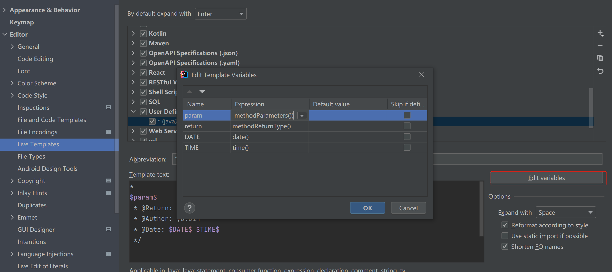

## 类模板
### 新增类方法注释模板

示例：
```java
#set($author = "yubin")
/**
* ${DESCRIPTION}
* @author ${author}
* @date ${YEAR}-${MONTH}-${DAY} ${TIME}
* @info best wish no bug
*/
```
### 引用注释模板


## 方法模板
### 选择File→Settings→Editor→Live Templates。点击右边的加号，选择Template Group，创建一个分组。

### 选择该group，新增live template
 expand with 使用enter,发现回车不生效,用space替换（idea版本2021.3）


```
*
$param$
 * @Return: $return$
 * @Author: yu.bin
 * @Date: $DATE$ $TIME$
 */
 ```
 ### 编辑参数

```
groovyScript("def result=''; def params=\"${_1}\".replaceAll('[\\\\[|\\\\]|\\\\s]', '').split(',').toList(); for(i = 0; i < params.size(); i++) {result+=' * @param ' + params[i] + ((i < params.size() - 1) ? '\\n' : '')}; return result", methodParameters())
```